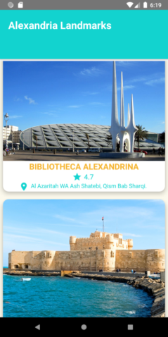

# SAFARI
Android application for booking hotels accommodation and trips inside the selected city

## Built With

* [Java]
* [Firbase]
* [Other Libraries]

## Contributing

Please read [CONTRIBUTING.md](https://github.com/m7mdramadandx/SAFARI/blob/master/CONTRIBUTING.md) for details.

## Authors

* [Muhammad Ramadan](https://www.linkedin.com/in/m7mdramadandx/)

## Screenshots for the App

